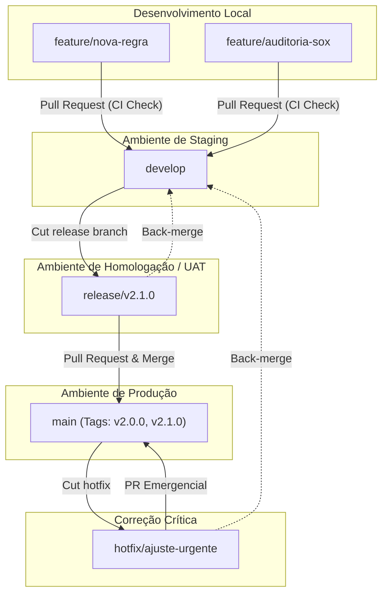

# 🚀 Guia de Operação GitFlow & CI/CD

Este documento descreve a arquitetura de branches (**GitFlow**) e as esteiras de automação (**CI/CD via GitHub Actions**) configuradas no projeto **DataOps Validator (Conciliação Contábil & Auditoria SOX)**.

---

## 🏗️ 1. Arquitetura de Branches (GitFlow)

O repositório adota o modelo **GitFlow**, garantindo separação rígida entre código em desenvolvimento, versões congeladas para validação e código estável em produção.



### Papel de Cada Branch

| Branch | Base de Origem | Merge Destino | Ambiente / Deploy | Política de Proteção |
|---|---|---|---|---|
| `feature/*` | `develop` | `develop` | Local | Sem proteção direta (deletar após merge) |
| `develop` | `main` | `release/*` | **Staging / Dev** | 🔒 PR obrigatório + CI aprovado |
| `release/*` | `develop` | `main` e `develop` | **Homologação / UAT** | 🔒 PR obrigatório + Testes de regressão |
| `main` | `release/*` | N/A | **Produção** | 🔒 PR obrigatório + Revisão manual + CI aprovado |
| `hotfix/*` | `main` | `main` e `develop` | **Produção** | 🔒 PR emergencial aprovado |

---

## ⚙️ 2. Mapeamento das Esteiras de CI/CD (GitHub Actions)

As automações estão divididas em 5 workflows complementares:

### 1. `ci-feature.yml` (Validação Rápida da Branch Feature - Fast Feedback)
* **Gatilho:** `push` direto em qualquer branch `feature/**` ou `feat/**`.
* **Ações:**
  1. ⚡ **Linter & Formatação:** Execução rápida do `ruff` e compilação de sintaxe.
  2. 🧪 **Testes Unitários:** Execução imediata do `pytest` com feedback em segundos.
  3. 📝 **Resumo no GitHub:** Posta um relatório no Step Summary indicando se o commit está apto para seguir em desenvolvimento.

### 2. `ci-pr-validation.yml` (Validação Completa de Pull Requests)
* **Gatilho:** Abertura ou atualização de PR tendo como destino `develop`, `release/**` ou `main`.
* **Ações:**
  1. 🔍 **Linter & Formatação:** Execução do `ruff` e validação sintática Python.
  2. 🛡️ **Segurança:** Varredura estática com `bandit` (SAST) em busca de vulnerabilidades e credenciais expostas.
  3. 🧪 **Matriz de Testes:** Execução do `pytest` em múltiplas versões do Python (3.11 e 3.12).
  4. 📊 **Cobertura:** Geração e armazenamento de relatório de cobertura de código (`coverage.xml`).
  5. 🐳 **Docker Check:** Validação de construção do contêiner Docker.

### 3. `cd-develop-staging.yml` (Entrega em Staging)
* **Gatilho:** `push` ou merge concluído na branch `develop`.
* **Ações:**
  1. Execução de testes de integração.
  2. Construção da imagem Docker etiquetada como `staging-<commit_sha>` e `staging-latest`.
  3. Publicação no **GitHub Packages (GHCR)**.
  4. Deploy automatizado para o ambiente `staging`.

### 4. `cd-release-homolog.yml` (Homologação & Auditoria SOX)
* **Gatilho:** Criação ou `push` em branches `release/**` (ex: `release/v2.1.0`).
* **Ações:**
  1. Extração automática da versão da release.
  2. Execução de testes de regressão estritos com barreira de cobertura (`--cov-fail-under=70`).
  3. Geração da imagem **Release Candidate** (`vX.Y.Z-rc.<run_number>`).
  4. Deploy no ambiente `homologation` para validação por auditores e stakeholders.

### 5. `cd-production.yml` (Produção & Releases Oficiais)
* **Gatilho:** Merge na branch `main` ou criação de tag de versão (`v*.*.*`).
* **Ações:**
  1. Sanity check final dos testes.
  2. Construção da imagem definitiva de produção com tags `latest` e `vX.Y.Z`.
  3. Publicação automática da **GitHub Release** com histórico extraído de `RELEASE_NOTES.md`.
  4. Deploy no ambiente de **Produção** (controlado pelo GitHub Environment com aprovação prévia).
  5. Geração de log rastreável de auditoria no Step Summary.

---

## 💻 3. Guia Prático do Desenvolvedor: Passo a Passo

### Cenário A: Criar uma Nova Feature

```bash
# 1. Atualizar a branch develop local
git checkout develop
git pull origin develop

# 2. Criar a nova branch de funcionalidade
git checkout -b feature/auditoria-regras-fiscais

# 3. Desenvolver código e testes
# Executar testes localmente antes do commit:
pytest test/test_app.py

# 4. Commit com mensagens semânticas
git add .
git commit -m "feat(auditoria): adiciona validacao de regras fiscais"

# 5. Enviar branch para o GitHub
git push -u origin feature/auditoria-regras-fiscais

# 6. Abrir Pull Request no GitHub com destino: develop
# A esteira ci-pr-validation.yml será executada automaticamente!
```

---

### Cenário B: Preparar uma Release (Homologação)

Quando o conjunto de features em `develop` estiver pronto para homologação:

```bash
# 1. A partir de develop atualizada, criar branch de release
git checkout develop
git pull origin develop
git checkout -b release/v2.1.0

# 2. Atualizar a versão e notas de versão
# Modifique RELEASE_NOTES.md com os detalhes da versão 2.1.0
git add RELEASE_NOTES.md
git commit -m "chore(release): prepara versao v2.1.0"

# 3. Enviar branch para o GitHub
git push -u origin release/v2.1.0

# O workflow cd-release-homolog.yml será acionado, publicando o RC em Homologação!
```

---

### Cenário C: Promover Release para Produção

Após homologação e validação de auditoria:

1. Abra um Pull Request de `release/v2.1.0` ➔ `main`.
2. Após aprovação do PR e merge em `main`:
3. Crie a tag oficial de release:

```bash
git checkout main
git pull origin main

# Criar tag anotada
git tag -a v2.1.0 -m "Release Oficial v2.1.0"
git push origin v2.1.0

# O workflow cd-production.yml fará o deploy e criará a GitHub Release oficial!
```

4. **Back-merge:** Sincronize eventuais correções da release de volta para `develop`:

```bash
git checkout develop
git pull origin develop
git merge main
git push origin develop
```

---

## 🔒 4. Configurações Recomendadas no Repositório GitHub

Para ativar todas as barreiras de segurança e governança:

### A. Regras de Proteção de Branches (`Settings > Branches`)

1. **Branch `main`:**
   - [x] **Require a pull request before merging** (mínimo 1 aprovação).
   - [x] **Require status checks to pass before merging**:
     - `Qualidade de Código & Linter`
     - `Auditoria de Segurança`
     - `Testes Automatizados (Python 3.11)`
     - `Testes Automatizados (Python 3.12)`
   - [x] **Do not allow bypassing the above settings**.

2. **Branch `develop`:**
   - [x] **Require a pull request before merging**.
   - [x] **Require status checks to pass before merging**.

### B. Ambientes com Aprovação Manual (`Settings > Environments`)

1. Crie os ambientes:
   - `staging`
   - `homologation`
   - `production`
2. No ambiente `production`:
   - Ative **Required reviewers** (defina os líderes técnicos ou responsáveis de compliance).
   - O GitHub pausará o workflow `cd-production.yml` até que o aprovador autorize o deploy.

---

## 🎓 5. Conformidade SOX e DataOps

* **Rastreabilidade (Traceability):** Toda alteração em produção tem autoria, commit SHA, log de execução do GitHub Actions e aprovação de PR documentados.
* **Segregação de Funções (Segregation of Duties):** Desenvolvedores não podem realizar push direto em `main` nem aprovar seus próprios PRs para produção.
* **Reprodutibilidade:** Contêineres Docker versionados garantem que o mesmo artefato homologado em `release/*` seja promovido a `main`.
